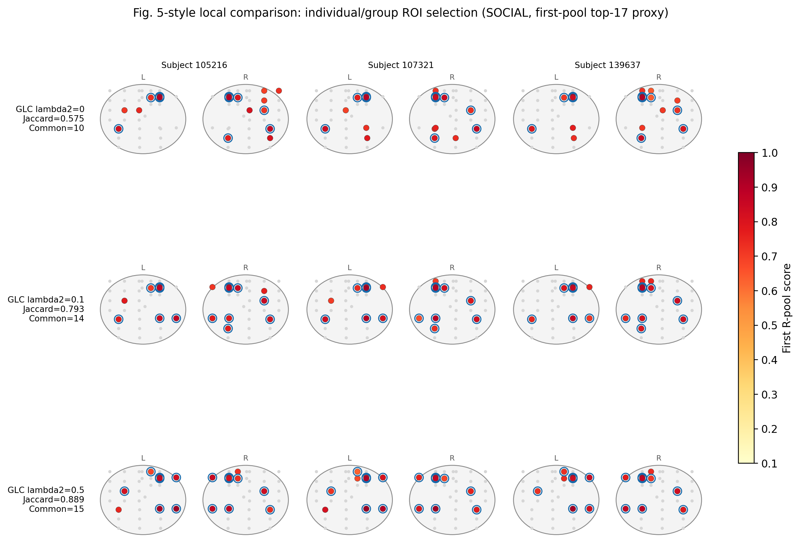
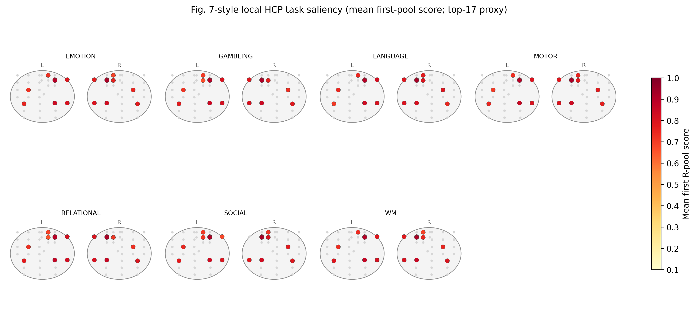
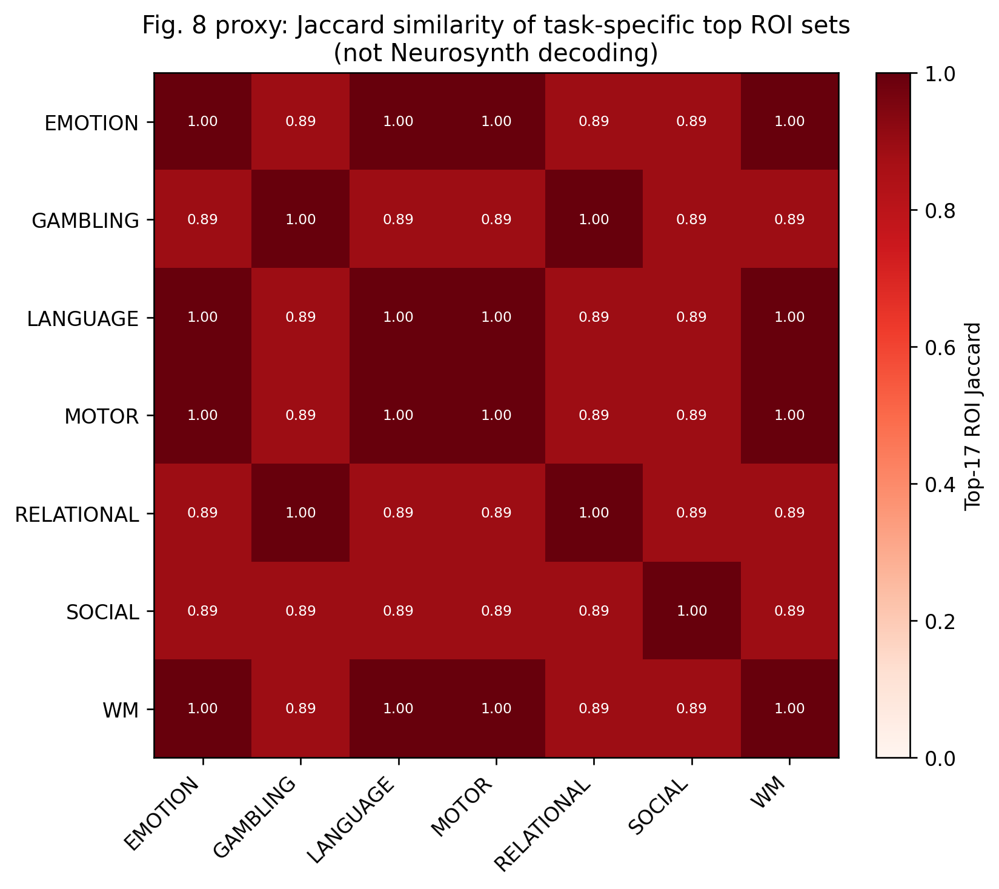
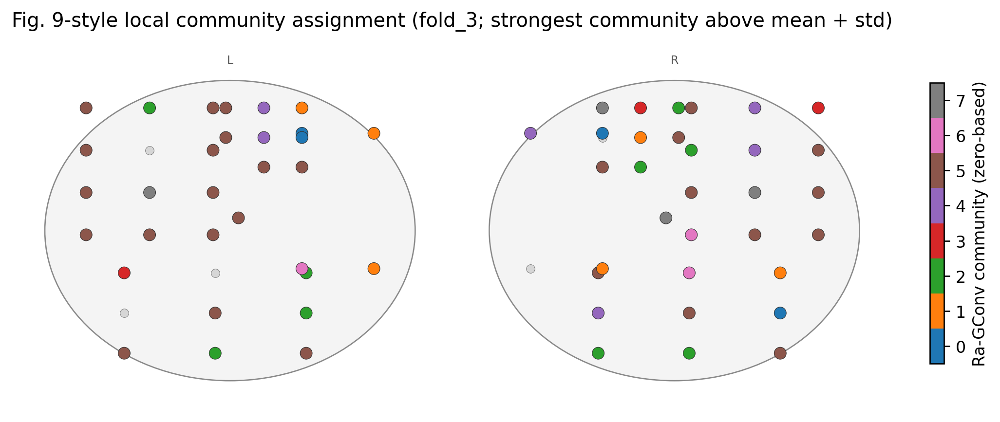
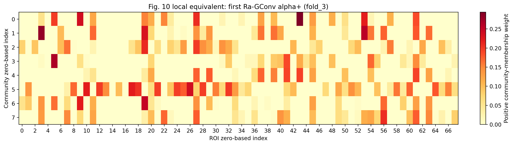

# BrainGNN HCP Subject-Wise Reproduction

This repository contains a current-model local reproduction of the HCP
experiments from BrainGNN. Training uses `07-main_hcp_subjectwise.py`; the
unified five-fold experiment entry point is
`15-run_hcp_subjectwise_new_baseline.py`.

The local study is a method reproduction, not an exact numerical reproduction
of the paper's HCP result. The available dataset contains 343 partially
observed subjects, 1,235 LR/RL run-level task graphs, seven task classes, and a
68-ROI cortical atlas. The paper used a different complete-subject cohort and
268 ROIs.

## Environment

For an RTX 50-series GPU, create the CUDA 12.8 environment:

```bash
conda create -n braingnn_rtx5070ti python=3.11 pip -y
conda activate braingnn_rtx5070ti
python -m pip install -r requirements-rtx5070ti.txt
```

Run the tests:

```bash
conda run --no-capture-output -n braingnn_rtx5070ti python -m pytest -q
```

## Dataset

Verify and extract the tracked split archive:

```bash
sha256sum -c artifacts/HCP900_subjectwise_qc_allsub_7task_lrrl.SHA256SUMS
cat artifacts/HCP900_subjectwise_qc_allsub_7task_lrrl.tar.zst.part-* \
  | tar --zstd -xf - -C data
```

The expected input root is:

```text
data/HCP900_subjectwise_qc_allsub_7task_lrrl/
  task_label_map.json
  sample_metadata.csv
  subjects/*.h5
```

Each graph uses Pearson-correlation rows as node features and positive top-10%
partial-correlation edges. Splits are deterministic and subject-wise, so a
subject never appears in more than one train/validation/test partition within
a fold.

Optional smoke test:

```bash
conda run --no-capture-output -n braingnn_rtx5070ti \
  python 06-hcp_subjectwise_pipeline_smoke.py \
  --data-root data/HCP900_subjectwise_qc_allsub_7task_lrrl \
  --edge-source pcorr --positive-edges-only --epochs 3
```

## Full Paper-Motivated Experiment Matrix

Run the current model's complete five-fold experiment matrix:

```bash
conda run --no-capture-output -n braingnn_rtx5070ti \
  python -u 15-run_hcp_subjectwise_new_baseline.py \
  --experiment all \
  --jobs 3 \
  --output-dir experiments/hcp900_subjectwise_paper_reproduction_current_20260612
```

Use `--jobs 1` if GPU memory is limited. Re-running the same command resumes
from completed fold summaries. Use `--no-skip-completed` only when every
selected fold must be retrained. CUDA deterministic algorithms are not forced,
so repeated runs can differ slightly despite using seed 123.

The runner covers:

- main paper-like BrainGNN result;
- CE/unit/TPK/GLC loss ablations;
- Ra-GConv versus shared-kernel vanilla-GConv;
- the paper-style `lambda1_TPK` and `lambda2_GLC` sweep;
- default-head versus approximately 96k-parameter capacity comparison.

Identical settings that occur in more than one paper table are trained once
and referenced by each relevant aggregate. The full matrix therefore executes
15 unique configurations x 5 folds = 75 training tasks.

Run only one experiment group:

```bash
conda run --no-capture-output -n braingnn_rtx5070ti \
  python -u 15-run_hcp_subjectwise_new_baseline.py \
  --experiment loss_ablation --jobs 3
```

Valid groups are `main`, `loss_ablation`, `conv_ablation`, `lambda_sweep`, and
`capacity`.

Run the classification baselines on the exact same exported subject splits:

```bash
ROOT=experiments/hcp900_subjectwise_paper_reproduction_current_20260612

conda run --no-capture-output -n braingnn_rtx5070ti \
  python 10-run_hcp_feasibility_baselines.py \
  --dataroot data/HCP900_subjectwise_qc_allsub_7task_lrrl \
  --split-manifest "$ROOT/split_manifest.json" \
  --output "$ROOT/baselines/majority.json"

conda run --no-capture-output -n braingnn_rtx5070ti \
  python 14-run_hcp_same_input_baselines.py \
  --dataroot data/HCP900_subjectwise_qc_allsub_7task_lrrl \
  --split-manifest "$ROOT/split_manifest.json" \
  --output "$ROOT/baselines/same_input_rbf_svm.json"
```

## Interpretability Summaries And Figures

After training, summarize the main model and the three GLC settings used by
the Section 3.5-style comparison:

```bash
ROOT=experiments/hcp900_subjectwise_paper_reproduction_current_20260612

conda run --no-capture-output -n braingnn_rtx5070ti \
  python 12-summarize_hcp_feasibility.py \
  --experiment-root "$ROOT/runs/paper_like" \
  --output "$ROOT/interpretability_summaries/paper_like.json"

conda run --no-capture-output -n braingnn_rtx5070ti \
  python 12-summarize_hcp_feasibility.py \
  --experiment-root "$ROOT/runs/ce_unit_tpk" \
  --output "$ROOT/interpretability_summaries/glc_0.json"

cp "$ROOT/interpretability_summaries/paper_like.json" \
  "$ROOT/interpretability_summaries/glc_0.1.json"

conda run --no-capture-output -n braingnn_rtx5070ti \
  python 12-summarize_hcp_feasibility.py \
  --experiment-root "$ROOT/runs/tpk_0.1_glc_0.5" \
  --output "$ROOT/interpretability_summaries/glc_0.5.json"
```

Generate the local equivalents of the paper's interpretation figures:

```bash
MPLCONFIGDIR=.tmp/matplotlib \
conda run --no-capture-output -n braingnn_rtx5070ti \
  python 13-plot_hcp_interpretability.py \
  --experiment-root "$ROOT" \
  --atlas data/hcp_atlas_workbench/100307.aparc.32k_fs_LR.dlabel.nii \
  --output-dir "$ROOT/interpretability_figures"
```

The Fig. 5- and Fig. 7-style maps use saved first-pooling top-17 scores as a
proxy because second-pooling ROI mappings are not saved. The Fig. 8-style
output is a task-ROI Jaccard heatmap, not Neurosynth decoding. Cortical maps
are anatomical schematics rather than surface-coordinate renderings.

## Generate The Report

```bash
conda run --no-capture-output -n braingnn_rtx5070ti \
  python 16-report_hcp_subjectwise_reproduction.py \
  --experiment-root "$ROOT"
```

Final compact artifacts are written under:

```text
experiments/hcp900_subjectwise_paper_reproduction_current_20260612/
  protocol.json
  split_manifest.json
  summary.json
  summary.csv
  aggregates/*.json
  baselines/*.json
  interpretability_summaries/*.json
  interpretability_figures/*
  report_data.json
  REPORT.md
```

Per-fold training logs, predictions, pooling scores, and community weights are
under `runs/`. This directory is intentionally ignored by Git because the
complete matrix is much larger than the compact aggregates and report.

## Final Experiment Results

The completed June 12, 2026 rerun used 15 unique configurations and five folds
per configuration. The full generated report is
[REPORT.md](experiments/hcp900_subjectwise_paper_reproduction_current_20260612/REPORT.md);
machine-readable results are in
[summary.json](experiments/hcp900_subjectwise_paper_reproduction_current_20260612/summary.json)
and
[report_data.json](experiments/hcp900_subjectwise_paper_reproduction_current_20260612/report_data.json).

### Main Result And Baselines

| Method | Accuracy | Balanced accuracy | Macro F1 |
|---|---:|---:|---:|
| Majority class | - | `0.1429 +/- 0.0000` | `0.0518 +/- 0.0037` |
| Same-input RBF-SVM | - | `0.7942 +/- 0.0403` | `0.8238 +/- 0.0344` |
| BrainGNN current paper-like | `0.8622 +/- 0.0215` | `0.8449 +/- 0.0205` | `0.8430 +/- 0.0234` |

BrainGNN improves mean balanced accuracy over the same-input RBF-SVM by
`+0.0507`; the paired five-fold t-test gives `p=0.06260`.

### Ablations And Capacity

| Experiment | Setting | Balanced accuracy |
|---|---|---:|
| Convolution | Ra-GConv | `0.8449 +/- 0.0205` |
| Convolution | Shared-kernel vanilla-GConv | `0.8226 +/- 0.0555` |
| Loss | CE only | `0.8129 +/- 0.0213` |
| Loss | CE + unit | `0.8183 +/- 0.0158` |
| Loss | CE + unit + TPK | `0.8041 +/- 0.0231` |
| Loss | CE + unit + GLC | `0.8601 +/- 0.0204` |
| Loss | Full loss | `0.8449 +/- 0.0205` |
| Capacity | Current default head, 55,719 parameters | `0.8449 +/- 0.0205` |
| Capacity | Approximately 96k head, 96,039 parameters | `0.8269 +/- 0.0246` |

The best tested lambda setting is `lambda1_TPK=0`, `lambda2_GLC=0.1`, with
balanced accuracy `0.8601 +/- 0.0204`. The complete lambda sweep and per-fold
results are in the generated report and `aggregates/` directory.

### Final Interpretability Figures

All final figures are stored in
[`interpretability_figures/`](experiments/hcp900_subjectwise_paper_reproduction_current_20260612/interpretability_figures/).
Each figure is available as PNG for preview and PDF for publication.

**Fig. 5-style: individual/group ROI consistency across GLC weights**



[PDF](experiments/hcp900_subjectwise_paper_reproduction_current_20260612/interpretability_figures/figure5_glc_individual_group.pdf)

**Fig. 7-style: task-level salient ROIs**



[PDF](experiments/hcp900_subjectwise_paper_reproduction_current_20260612/interpretability_figures/figure7_task_salient_rois.pdf)

**Fig. 8-style: task-ROI similarity proxy**



[PDF](experiments/hcp900_subjectwise_paper_reproduction_current_20260612/interpretability_figures/figure8_proxy_task_roi_similarity.pdf)

**Fig. 9-style: Ra-GConv community assignments**



[PDF](experiments/hcp900_subjectwise_paper_reproduction_current_20260612/interpretability_figures/figure9_community_assignments.pdf)

**Fig. 10-style: positive community weights**



[PDF](experiments/hcp900_subjectwise_paper_reproduction_current_20260612/interpretability_figures/figure10_alpha_positive_heatmap.pdf)

The mean within-task top-17 ROI Jaccard is `0.4826`, `0.8172`, and `0.8832`
for GLC weights 0, 0.1, and 0.5, respectively. The corresponding community
stability values are `0.8614`, `0.9081`, and `0.9626`.

## Single-Fold Trainer

For debugging one fold directly:

```bash
conda run --no-capture-output -n braingnn_rtx5070ti \
  python -u 07-main_hcp_subjectwise.py \
  --dataroot data/HCP900_subjectwise_qc_allsub_7task_lrrl \
  --fold 0 --n_epochs 100 --batchSize 64 \
  --edge_source pcorr --edge_top_percent 0.10 --positive_edges_only \
  --best_metric balanced_acc \
  --output_dir experiments/debug_hcp_fold0
```

## Legacy Workflows

The ABIDE example remains available through `01-fetch_data.py`,
`02-process_data.py`, and `03-main.py`. The older merged-graph HCP feasibility
workflow is retained in scripts `08` through `14` and under
`experiments/hcp900_feasibility_68roi/`; those results must not be mixed with
the current 1,235-graph run-level reproduction.

## Citation

```latex
@article{li2020braingnn,
  title={Braingnn: Interpretable brain graph neural network for fmri analysis},
  author={Li, Xiaoxiao and Zhou,Yuan and Dvornek, Nicha and Zhang, Muhan and Gao, Siyuan and Zhuang, Juntang and Scheinost, Dustin and Staib, Lawrence and Ventola, Pamela and Duncan, James},
  journal={bioRxiv},
  year={2020},
  publisher={Cold Spring Harbor Laboratory}
}
```
